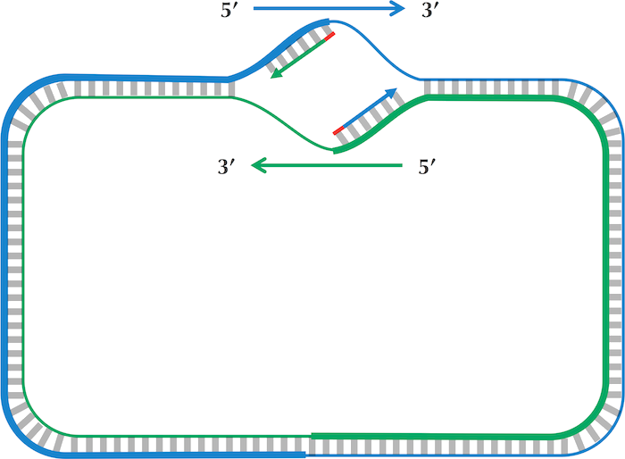

# Chapter 1: Where in the Genome Does Replication Begin?

*Algorithmic Warmup*

> Cover of Chapter 1. &copy; P. Compeau, P. Pevzner.

## Introduction

In this first chapter, we will discuss the search for the *origin of replication* or *ori* in short. This is the position where a DNA polymerase enzyme can recognize and bind to a strand of the DNA double helix. This is an essential first step in the replication (or duplication) of DNA. Besides its importance in fundamental biological research, the ori also finds many applications in biotechnology e.g., in the design of plasmids for genetically enhanced bacteria. Typical lengths of the ori region are several hundreds of bases. Without delving too much into the underlying biology (which I will not pretend to know and/or understand), the actual binding events with the polymerases occur on DnaA boxes, which are shorter stretches of DNA that bind the DnaA helper protein. It is exactly these sequences that we will be looking for.

First of all, for anyone who has ever come into contact with a programming language, this may seem like a relatively trivial task. Given a `genome : str` and ori `pattern : str`, one could just look for an occurence of that pattern in the genome. However, we are dealing with biology here, which is not the most exact of sciences. The binding to the DnaA box is not so strict that it will only occur with one matching pattern. In fact, this would have been an evolutionary disadvantage! Due to mutations, the *ori* sequence could become altered and further replication would become impossible, directly leading to the demise of the cell. Therefore, we should not only search for the exact match 'pattern' but instead for `neighbors : list[str]`, an array of similar patterns, each differing from the original pattern in only a couple locations.

Secondly, we should not only search for `neighbors` of the original pattern, but also for its *reverse complement*. Explaining this, will require me to dig up some long lost knowledge on molecular biology. In explanation such as these, I am likely to cut too many corners and offend the hardcore molecular biologist but, again, the goal is to just explain the algorithmic design.

Here goes, most people know about the double-helix structure of DNA. Two strands of oppositely paring nucleobases bind to one another through Watson-Crick base-paring. However, the fact that each of those strands has an inherent directionality, is not general knowledge. One of the strands is said to be in the 5'-3' direction, whereas the other is mirrored i.e., in the 3'-5' directions. Do not worry too much about these names, they originate in the organic chemistry that describes the building blocks of DNA, the nucleotides. This is relevant because DNA polymerase is apparently a *unidirectional* enzyme i.e., it can only extend a growing DNA copy strand in the 3'-5' direction.

> DNA replication. &copy; P. Compeau, P. Pevzner.

The above schematic can more clearly explain the issue: replication starts at the *ori* and halts at the *termination site* or *ter*, which is typically located approximately opposite the *ori* in circular bacterial genomes. So, in order to cover the whole genome, DNA replication must be able to start on *both* DNA strands. So, the set of patterns we are looking for should be extended to `neighbors(p, p_c) : set[str]`, or all similars of the original pattern *and* its reverse complement. With this in mind, the algorithmic design can begin.

## Finding *ori* in the genome

Skew

## Finding repeating patterns in *ori*

frequent_words

## Finding neighbors of a string

Neighbors

## Finding DnaA boxes in *ori*

frequent_words_mismatches_reverse_complements

<[Contents](00_toc.md)>	<[Next](02_random.md)>
