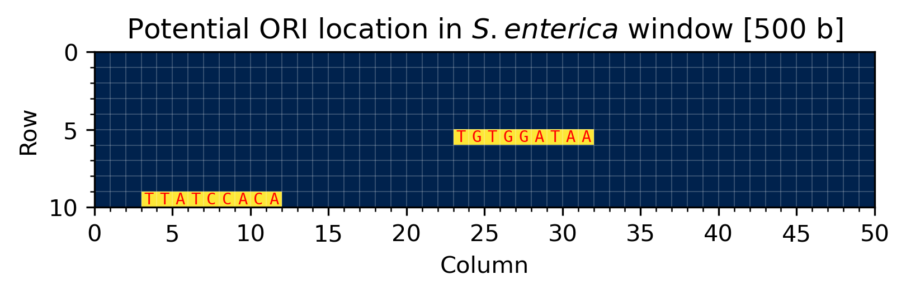

# Chapter 1: Where in the Genome Does Replication Begin?

*Algorithmic Warmup*

> Cover of Chapter 1. &copy; P. Compeau, P. Pevzner.

## Introduction

In this first chapter, we will discuss the search for the *origin of replication* or *ori* in short. The *ori* is a very interesting point in the genome, both from a fundamental biological as from a applied biotechnological perspective. It is precisely at this location that a DNA polymerase enzyme can recognize and bind a strand of the DNA double helix. This is an essential first step in the replication (or duplication) of DNA. Nevertheless, *ori* is, at least from a computational standpoint, a rather vague definition. Biologically speaking, it's simply a sequence of DNA with typical lengths of several hundreds of bases, inside the much larger genome. Without delving too much into the underlying biology (which I will not pretend to know and/or understand), the actual binding events with the polymerases occur on DnaA boxes, which are shorter stretches of DNA inside the *ori* that bind the DnaA helper protein. It is exactly these sequences that we will be looking for. 

We can subdivide our this main programming task in four more manageable parts:
1. Finding an approximate location for the *ori* inside the genome.
2. Finding the most common patterns inside the *ori*.
3. Accounting for possible mutations of the DnaA box.
4. Accounting for the unidirectionality of DNA polymerase.

## Finding *ori* in the genome

When representing every building block of a genome with a single text character, even simple genomes are still quite long text files. For example, the genomes of [*E. coli*](Assets/Text/01_ecoli.txt) and [*S. enterica*](Assets/Text/01_salmonella_enterica.txt) are 4.6 Mb and 4.8 Mb (megabases, millions) long. As will be discussed below, we will be looking for a relatively extensive set of strings, which would take up significant computation time in such a large dataset. Ideally, we would first define a relevant location which houses the *ori* within some margin of error. Searching in this more narrow slice of DNA would cut down computations by a significant factor. So, we need to find some calculable metric to define the approximate location of the *ori*.

Luckily, biological understanding comes to the rescue once again. Remember that replication involves a binding of DNA polymerase to a DnaA box at the *ori*. To actually insert the DNA polymerase at this location, replication involves a temporary break of the double-stranded structure, which decreases the chemical stability of the DNA building blocks. Also remember that DNA polymerase can only replicate a template strand in the 3'-5' direction. So, strands upstream (in the 5' direction) from *ori* are replicated quickly and spend the majority of their lifetime as stable, double-stranded DNA. Conversely, fragments downstream (in the 3' direction) form *ori* rely on a much more extensive replication scheme, involving [Okazaki fragments](https://en.wikipedia.org/wiki/Okazaki_fragments). Discussing this would lead us too far, but due to this more complex pathway, these strands are exposed as single-stranded DNA for much longer periods of time. The below figure will likely shed more light in this issue.

> Forward and reverse half-strands in DNA replication. &copy; P. Compeau, P. Pevzner.

How can we computationally apply this newfound knowledge? Well, one of the degradation events single-stranded DNA is exposed to is *cytosine deamination*. One of the four DNA building blocks, cytosine (C), is particularly sensitive to a form of chemical alteration which changes its structure to another DNA building block: thymine (T). If we treat DNA as a more or less random collection of nucleotides, we would expect a nearly equal distribution of all building blocks (A, C, G, T) along its whole sequence. However, due to this preferential degradation of C in the forward half-strands (downstream from *ori*), we should expect a shift in GC-content right around the *ori*. Upstream from *ori*, strands are mainly double-stranded and cytosine should be abundant, while downstream from *ori* strands are more often single-stranded and cytosine is quickly degraded (and thymine will be more prominent). Algorithmically, we can simply calculate the `G-C` count while sliding over the sequence. The *ori* should then be at the index where this difference is minimal (where cytosine switches from common to rare), while the *ter* is at the index where this difference is maximal. This simple algorithm to find the *ori* is called *GC-skew*.   

Algorithmically, this skew can be calculated as follows:

    def skew_diagram(genome : str) -> list[int]:
        '''
        Given a genome, calculate the GC-skew along the whole sequence.

        Parameters
        ----------
        genome : str
            The sequence for which to calculate the GC-skew.

        Returns
        -------
        list[int]
            The current GC-skew at each individual index.
        '''
        skews = [0]
        for base in genome:
            if base == 'C':
                skews.append(skews[-1] - 1)
            elif base == 'G':
                skews.append(skews[-1] + 1)
            else: 
                skews.append(skews[-1])
        return skews

To find all indices where the GC-skew is minimal, we can simply use:

    def minimum_skew(genome: str) -> list[int]:
        '''
        Given a genome, find all locations where the skew is minimal. Skew for a
        fragment of length i is defined as the total G-C count.

        Parameters
        ----------
        genome : str
            The genome to search for skews.

        Returns
        -------
        list[int]
            The skew values for all subfragments.
        '''
        skews = skew_diagram(genome)
        min_skew = min(skews)
        indices = []

        i = 0
        while i < len(skews) - 1:
            fragment = skews[i:]
            try:
                i_new = i + fragment.index(min_skew)
                indices.append(i_new)
                i = i_new + 1
            except ValueError:
                return indices

Using this function, we should be able to find the approximate location of the *ori*. Let's try to plot the GC-skew along the genome of *Salmonella enterica*.

> Anotated plot of the GC-skew along the genome of *S. enterica*. The *ori* is likely located somewhere around 3.7 Mb.

This appears to work great! Based on this quick and dirty algorithm, we have found a good approximation for the *ori* in a previously unknown genome. Let us define the potential *ori* as a window that is 500 b wide and starts right 50 b before the minimal skew:

	ACCTGACCCC TTTCTATGAA GACCTTCAGA CGCAGAAACC CGATCTTTCC
	GCGGTACGTT TCGGCGCAAT TGGCATTGGC AGTCGAGAAT ACGACACGTT
	TTGCGGCGCG ATTGAGAAAA TAGAAGCGGA ACTGAAAGGC GCTGGCGCAA
	AACAGGTTGG GGAAACACTG AAGATCAACA TCCTTGAACA TGAGATTCCG
	GAAGATCCAG CGGAGATTTG GCTCGGATCC TGGATTAATT TACTCAAATA
	AGTGTAAAGA TCGTGCGATC TATTGTGGAT AAATATGGTG AAAAGCTTGG
	ATCAACCGGT AGTTATCCAA AGAATAACCT TTGTTCACTT TTTGAGTTGT
	GTATAAGTAC CCGTTTTGAT CCCAGCTTAT ACGGGCCACG ATCACCGATC
	ATTCACAGCT AGTGATCCTT TCCAACGCAT TGATCTTTAT TACAGGATCC
	GGGTTATCCA CAGCCTGGTG CGATCCTAAT AAGAGATCAC AATAGAACAG'

Now that we defined a more narrow window around *ori*, we can proceed with the definition of patterns to look for in this stretch.

## Finding common patterns in *ori*

For anyone who has ever come into contact with a programming language, finding a certain characters inside a text may seem like a relatively trivial task. Given a `genome : str` and *ori* `pattern : str`, one could just look for all occurrences of that pattern in the genome. The main difficulty lies in the fact that oftentimes the pattern we are looking for is actually unknown! But, how can we look for a pattern that we don't even know the sequence of?

The answer lies, again, in the lenience of biology. Inside the *ori*, the DNA polymerase must be able to bind efficiently. So, having only a single DnaA box available is too risky. Imagine that it mutates beyond recognition, or that the DNA polymerase misses it for some other reason. This could once again inhibit efficient replication. So, the *ori* should contain several copies of the actual DnaA box, such that binding of the polymerase is more reliable. Likely, the actual binding location will be the pattern that emerges most frequently inside the *ori*. So, once the general location of the *ori* is known, we should look for all patterns that pop up with the highest frequencies inside this region. 

The easiest way to programmatically identify the patterns with the most occurrences is to track all patterns of  in a frequency table while sliding across the genome. This `frequency_table` can be obtained as follows:

	def get_frequency_table(text : str, length : int) -> dict:
	    '''
	    Given a text (string) and a size k (int), return the a frequency table of
	    occurences of text fragment of length in the text.
	    
	    Parameters
	    ----------
	    text : str
	        The text to look for patterns.
	    length : int
	        The length of the pattern to look for.

	    Returns
	    -------
	    dict
	        A frequency table of occurences of fragments of given length inside text.
	    '''
	    # Construct frequency table.
	    frequent_words = {}
	    for i in range(len(text) - length + 1):
	        fragment = text[ i : i + length ]
	        try:
	            frequent_words[fragment] += 1
	        except KeyError:
	            frequent_words[fragment] = 1
	    return frequent_words

Once this table is constructed, we simply need to grab patterns at positions where the frequency is maximal:

	def frequent_words(text : str, length : int) -> list:
	    '''
	    Given a text (string) and a size k (int), return the text fragment of 
	    length k that occurs most in the text.
	    
	    E.g. 'ACG TCG CGC GAC GTA', 2 -> ['CG']
	         'ATA ATA CGC CGC'    , 3 -> ['ATA', 'CGC']
	    
	    Parameters
	    ----------
	    text : str
	        The text to look for patterns.
	    length : int
	        The length of the pattern to look for.

	    Returns
	    -------
	    list
	        The fragment of length k with the most occurences.
	    '''
	    ft = get_frequency_table(text, length)
	    # Find max frequency and get all values with that frequency.
	    max_count = max(ft.values())
	    frequent_list = [ fragment for fragment, count in ft.items() 
	                      if count == max_count ]   
	    return sorted(frequent_list)

So, assuming that the DnA box appears as one of the most frequent patterns in the *ori* region, we can find potential candidates with the above algorithm. However, in order to increase the reliability of our predictions, we need to account for every biologist's worst nightmare: variability. 

## Finding neighbors of a string

It is well-known that DNA carries the genetic information of an organism in chemical form. Naturally, this data should be well protected i.e., the DNA strand should be a chemically stable structure. However, as we already discussed above, DNA mutations can (and frequently do) happen. Therefore, it is possible that a DnaA boxes mutates and swaps one or two nucleotides for a different one. How does this impact our algorithmic design?  

The binding to the DnaA box is not so strict that it will only occur with one matching pattern. In fact, this would have been an evolutionary disadvantage! Due to mutations, the *ori* sequence could become altered and further replication would become impossible, directly leading to the demise of the cell. Therefore, we should not only search for the exact match `pattern` but instead for `neighbors : list[str]`, an array of similar patterns, each differing from the original pattern in only a couple locations.

In order to generate mismatched sequences, we first need to quantify mismatching mathematically, which we can do using the Hamming distance between two strings:

	def hamming_distance(s1 : str, s2 : str) -> int:
	    '''
	    Given 2 strings of equal length, return the amount of characters in which
	    they differ.

	    Parameters
	    ----------
	    s1 : str
	        The first string.
	    s2 : str
	        The second string.

	    Returns
	    -------
	    int
	        The Hamming distance between both strings.
	    '''
	    distance = 0
	    for c1, c2 in zip(s1, s2):
	        if c1 != c2:
	            distance += 1
	    return distance

This simple functions counts all the indices where two strings of equal length differ. Based on this, we can now recursively construct the neighborhood of a pattern. We remove the first base from the `pattern : str` to create a `suffix : str`. If this `suffix` does not exceed the allowed mismatches, we can add any base to make a valid `neighbor`. If the `suffix` is already too dissimilar from the original, we have to add the first base of the `pattern` instead. By recursively cycling through the whole pattern, we can construct a complete `neighborhood : set`. Of course, we need to apply appropriate boundary conditions. Recursion should stop when the pattern has exhausted all elements but the very last. Alternatively, if no mismatches are allowed, the only valid `neighbor` is the original `pattern`. In code, this looks more or less like this:

	def neighbors(pattern : str, mismatches : int) -> set[str]:
	    '''
	    Given a pattern and a maximal number of mismatches, construct a set of all
	    patterns of which the Hamming distance is equal or smaller than the 
	    number of mismatches.

	    Parameters
	    ----------
	    pattern : str
	        The pattern to construct the neighborhood of.
	    mismatches : int
	        The maximal amount of mismatches any given neighbor can have.

	    Returns
	    -------
	    set[str]
	        The neighborhood of the pattern, containing all strings with at most
	        the given number of mismatches.
	    '''
	    # Recursion boundary conditions.
	    if mismatches == 0:
	        return {pattern}
	    if len(pattern) == 1:
	        return {'A', 'C', 'G', 'T'}
	    # Proceed with recursion.
	    else:
	        neighborhood = set()
	        # Recursively loop through the pattern, always removing the first base.
	        suffix_neighbors = neighbors(pattern[1:], mismatches)
	        for neighbor in suffix_neighbors:
	            # The suffix does not exceed the number of mismatches.
	            # Put any base at start.
	            if hamming_distance(pattern[1:], neighbor) <  mismatches:
	                for base in tuple('ACGT'):
	                    neighborhood.add(base + neighbor)
	            # The suffix has the max amount of mismatches.
	            # Put the first base of the pattern at the start.
	            else:
	                neighborhood.add(pattern[0] + neighbor)
	        return neighborhood

## Finding DnaA boxes in *ori*

Finally, we should not only search for `neighbors` of the original pattern, but also for its *reverse complement*. Explaining this, will require me to dig up some long lost knowledge on molecular biology. In explanation such as these, I am likely to cut too many corners and offend the hardcore molecular biologist but, again, the goal is to just explain the algorithmic design.

Here goes, most people know about the double-helix structure of DNA. Two strands of oppositely paring nucleobases bind to one another through Watson-Crick base-paring. However, the fact that each of those strands has an inherent directionality, is not general knowledge. One of the strands is said to be in the 5'-3' direction, whereas the other is mirrored i.e., in the 3'-5' direction. Do not worry too much about these names, they originate from the organic chemistry that describes the building blocks of DNA: the nucleotides. In text format, a double-stranded DNA helix looks more or less like this:

    5'- ACG TTA CGA TGC TTC GAT TGA TAG ACG TAC -3'
    3'- TGC AAT GCT ACG AAG CTA ACT ATC TGC ATG -5'

This directionality of DNA is relevant because DNA polymerase is apparently a *unidirectional* enzyme i.e., it can only extend a growing DNA strand in the 3'-5' direction. The schematic below can more clearly explain the issue: replication starts at the *ori* and halts at the *termination site* or *ter*, which is typically located approximately opposite the *ori* in circular bacterial genomes. So, in order to cover the whole genome, DNA replication must be able to start on *both* DNA strands.

> DNA replication. &copy; P. Compeau, P. Pevzner.

With this in mind, the set of patterns we are looking for should be extended to `neighbors(p, p_c) : set[str]`, or all similars of the original pattern *and* its reverse complement.  We can incorporate this in our algorithm by not only looping over the original strand, but also over its reverse complement: 

	def frequent_words_mismatches_reverse_complements(genome : str,
	                                                  length : int,
	                                                  mismatches : int) -> set[str]:
	    '''
	    Given a genome, generate the set of all patterns of a given length that 
	    occur the most in the genome. Found instances can have at most a given 
	    number of mismatches. Reverse complements are also accepted.

	    Parameters
	    ----------
	    genome : str
	        The genome to search in.
	    length : int
	        The length of the patterns to look for.
	    mismatches : int
	        The maximal amount of mismatches a pattern can have.

	    Returns
	    -------
	    set[str]
	        The most occuring patterns and their reverse complements.
	    '''
	    # Data storage.
	    patterns = set()
	    freq_map = dict()
	    for strand in (genome, reverse_complement(genome)):
	        for i in range(len(genome) - length + 1):
	            # For every pattern, generate the all similars with mismatches.
	            pattern = strand[i : i + length]
	            neighborhood = neighbors(pattern, mismatches)
	            for neighbor in neighborhood:
	                try:
	                    freq_map[neighbor] += 1
	                except KeyError:
	                    freq_map[neighbor] = 1
	    # Find all patterns with maximal frequency.
	    freq_max = max(freq_map.values())
	    for pattern, freq in freq_map.items():
	        if freq == freq_max:
	            patterns.add(pattern)
	    return sorted(patterns)

## Epilogue

In order to evaluate our DnaA box finding algorithm, let's apply it to the genome of *S. enterica*. Based on the GC-skew, we already found a good starting point for the *ori* at around 3.7 Mb (3,764,856 b to be exact). We can define a window of 500 b wide, starting 50 b in front of this minimum skew. As *S. enterica* is closely related to the more well-known *E. coli*, let us look for patterns with similar properties as the DnaA boxes of *E. coli*: with a length of 9 and at most a single mismatch.

	# Determining ori window and search settings.
	width = 500
	before = 50
	window = salmonella.genome[i_min_skew - before : i_min_skew + (width - before)]
	length = 9
	mismatches = 1
	# Finding DnaA boxes.
	potential_dnaa = frequent_words_mismatches_reverse_complements(window, length, mismatches)
	dnaa = [ dnaa for dnaa in potential_dnaa if dnaa in window ]

If we unleash our algorithm with these parameters, we find two possible DnaA box candidates: `TGTGGATAA` and `TTATCCACA`. Let us plot a graphical representation of their location in the *ori* window.

> Graphical representation of the potential DnaA boxes in the chosen window.

Now, the question remains how reliable our algorithm actually is. For a truly novel genome, the results would have to be experimentally confirmed by removing the DnaA boxes from the genome or plasmid through mutation or excision. We could, for example, transform a *S. enterica* population with a plasmid encoding for a fluorescent protein. A second population would receive an identical plasmid where only the potential DnaA boxes are removed. If the algorithmic predictions were correct, we would expect a significantly decreased fluorescent signal of colonies with the mutated *ori* region.

Luckily, our model organism *S. enterica* (*Salmonella enterica* subsp. enterica serovar *Typhi* str. CT18 chromosome, to be more precise) is not nearly unique enough to warrant novel experimental research. We can simply look up our organism in any of the online databases, such as [DoriC](http://tubic.tju.edu.cn/doric/public/index.php/information/bacteria/ori10020010.html). And, what do we have here?! The database lists nucleotide 3,764,856 as the start of the *ori* window, which identical to the index predicted by our minimization of the GC-skew. More importantly, the database lists 4 DnaA boxes with sequences `TGTGGATAA`, `TTATCCAAA`, `TGTGTATAA` and `TTATCCACA`. Two of these (`TGTGGATAA` and `TTATCCACA`) are exactly matched by our reverse complement neighbors algorithm while the others are found with a single mismatch each (`TGTG-A-ATAA` and `TTAT-T-CACA`).

In conclusion, by using relatively straightforward algorithms, we managed to estimate the location of the *ori* in the genome and successfully identify potential candidates for DnaA boxes inside this *ori* window. This information could tremendously speed up fundamental biological research in the search for novel origins of replication. Instead of randomly removing parts of the suspected *ori*, bioinformatics can quickly pinpoint potential regions-of-interest for further experimental exploration. 

<[Contents](00_toc.md)>	<[Next](02_random.md)>
