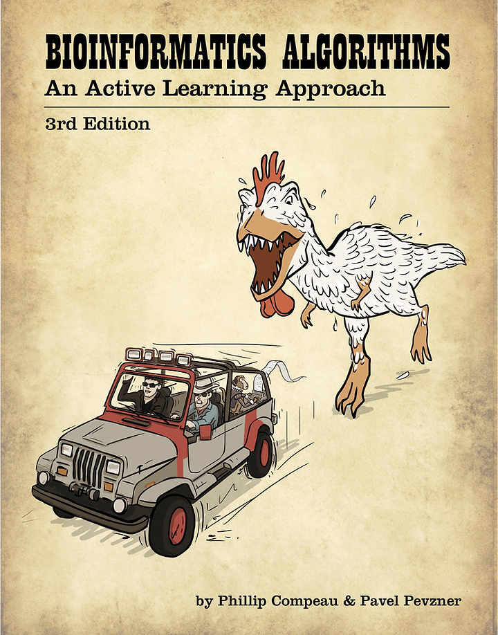

# Introduction

> Cover art of 'Bioinformatics Algorithms'. &copy; P. Compeau and P. Pevzner.

## The source material

In this blog, I am planning to document my journey and learnings from the 'Bioinformatics Algorithms: An active learning approach' handbook, written by P. Compeau and P. Pevzner. This exciting book is available on [Amazon](https://www.amazon.com/BIOINFORMATICS-ALGORITHMS-Phillip-Compeau-dp-0990374637/dp/0990374637/), [Stepik](https://stepik.org/course/55789) and its [own website](https://www.bioinformaticsalgorithms.org/read-the-book). The book covers various algorithmic topics in the field of bioinformatics (see the table of contents below). Every chapter pinpoints a unique biological question and provides the reader with practical challenges of rapidly increasing difficulty. This culminates in an epilogue, where you are invited to apply all the gathered knowledge by working with a real bioinformatics dataset.

## Practicalities

I will be programming purely in Python 3.10.4 (the latest stable version at the time of writing), although I doubt I will be using many features that cannot be compiled any reasonably recent version of Python. All development will be done in the (amazing) Spyder 5.2.2. IDE. When discussing variables and coding in the text, I will use the PEP syntax: `variable : type` or for iterables `iterable : type[element type]`. For example, `name : str` or `names : list[str]`.

## About me

Hi! My name is Ben De Jonge, from Belgium. I am a 25 year old researcher at imec Leuven. I graduated from KU Leuven with both a science (Biochemistry) and engineering degree (Nano-Engineering). In the last couple of years, I discovered my interest for programming, specifically with Python. Gradually, I found my way into bioinformatics, which led me to this handbook. I am planning to slowly crawl my way through this, solving all the assignments along the road and documenting my understandings here.

<[Contents](00_toc.md)>
